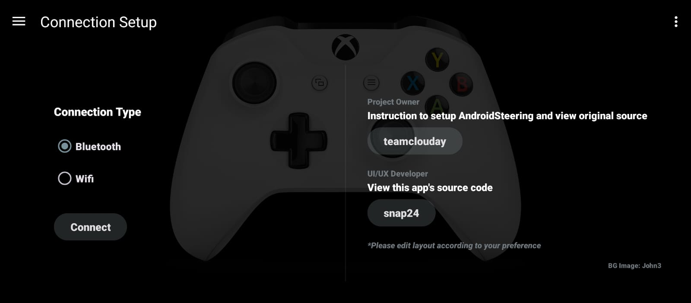
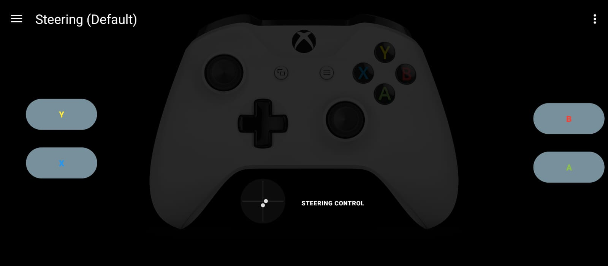
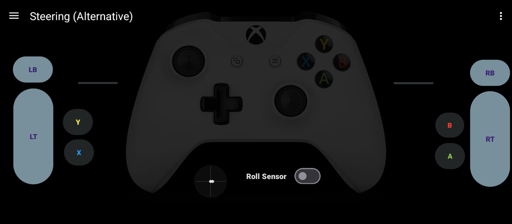
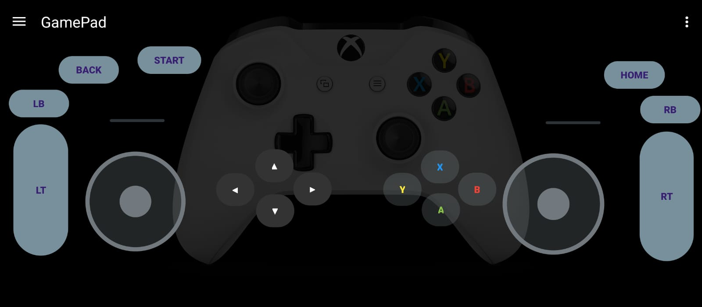
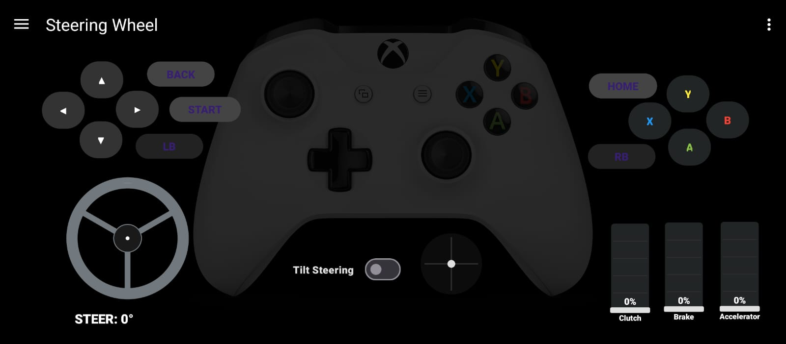

<h1 align="center">AndroidSteering - UI/UX Overhaul Edition</h1>

  
  
  
  

  

 

A massive UI/UX update to the incredible **AndroidSteering** project originally created by [teamclouday](https://github.com/teamclouday). This application turns your Android phone into a fully functional PC racing wheel and gamepad via Wi-Fi or Bluetooth. 

This fork provides an updated interface, improved multi-touch support, and customizable control layouts.

---

## Special Thanks & Credits
**All core networking, math logic, and Windows PC server infrastructure were originally engineered by [teamclouday](https://github.com/teamclouday/AndroidSteering).** 

This project would not exist without their brilliant foundation. This fork serves to build upon their hard work by providing a completely redesigned frontend and fixing some edge-case control bugs, aiming to provide the ultimate plug-and-play racing experience.

For full setup instructions, documentation, and the Windows Server executable, please visit the original repository: [teamclouday/AndroidSteering](https://github.com/teamclouday/AndroidSteering).

---

## Interface Gallery

   &nbsp;&nbsp;&nbsp; 

 

   &nbsp;&nbsp;&nbsp; 

 

  

---

## What's New in this Overhaul

- Editable UI elements
- Set mapping mode
- Import and export of layouts

> **Note:** Included are pre-configured layouts in [Assets/steering_layouts.json](Assets/steering_layouts.json). The layout elements may not be perfectly aligned for every device's screen size or aspect ratio. Please make sure to enter edit mode and adjust them to your preference! This app is fully tested on Forza Horizon 6.

---

## License

Distributed under the Apache License 2.0. See [LICENSE](LICENSE) for further information.

---

Maintained by [snap24](https://github.com/snap24).
